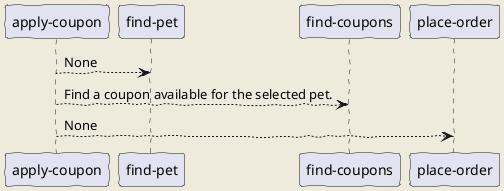

# apply-coupon

This is how you can find a pet, find an applicable coupon, and apply that coupon in your order. The workflow concludes by outputting the ID of the placed order.

## Workflow Diagram

## Steps

### find-pet

**ID**: find-pet

None

### find-coupons

**ID**: find-coupons

Find a coupon available for the selected pet.

### place-order

**ID**: place-order

None

