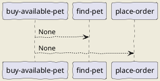

# buy-available-pet

This workflow demonstrates a workflow very similar to `apply-coupon`, by intention. It's meant to indicate how to reuse a step (`place-order`) as well as a parameter (`page`, `pageSize`).

## Workflow Diagram

## Steps

### find-pet

**ID**: find-pet

None

### place-order

**ID**: place-order

None

