# place-order

This workflow places an order for a pet. It may be reused by other workflows as the "final step" in a purchase.

## Workflow Diagram

```plantuml
@startuml
skinparam backgroundColor #EEEBDC
skinparam handwritten true

participant "place-order" as place_order
participant "place-order" as place_order
place_order --> place_order : None
@enduml
```

## Steps

### place-order

**ID**: place-order

None

